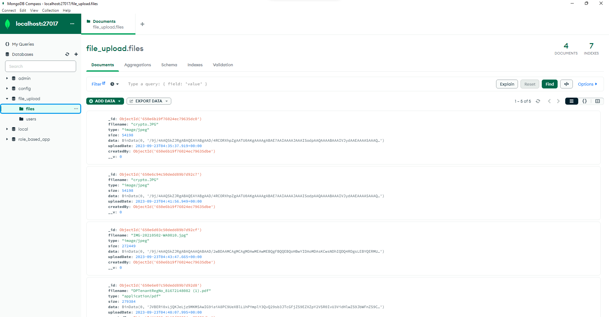
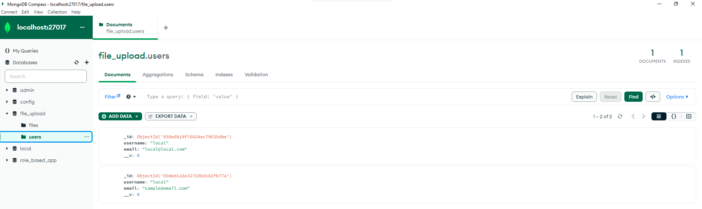
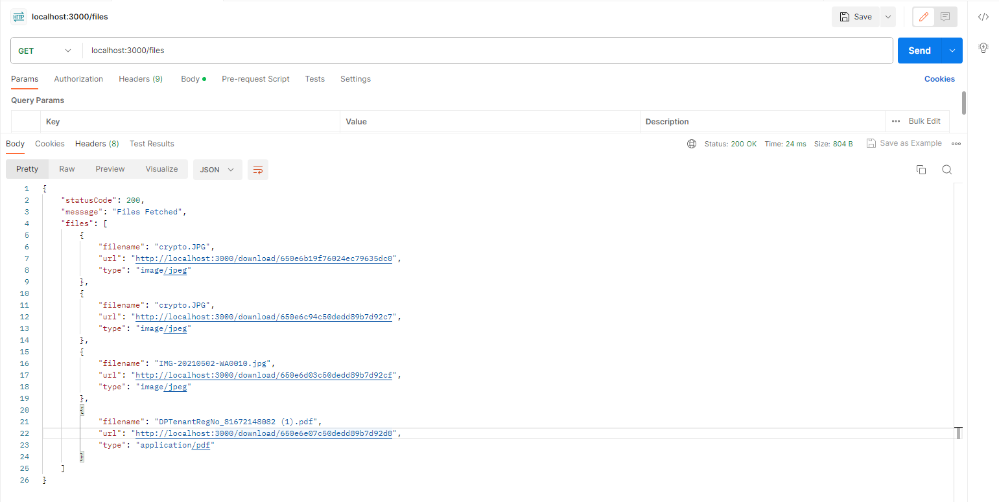
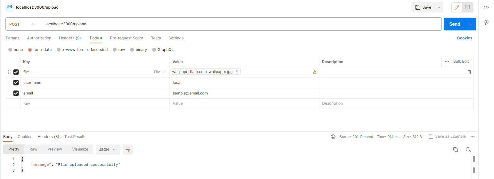

<!-- @format -->

# Table of Contents

- [File Upload and Download System](#file-upload-and-download-system)
- [Basic Information](#basic-information)
- [Preview](#preview)
  - [DB Design for Files Collection](#db-design-for-files-collection)
  - [DB Design for Users Collection](#db-design-for-users-collection)
  - [Fetching the Records from Files Collection via POSTMAN](#fetching-the-records-from-files-collection-via-postman)
  - [Uploading file to the Files Collection via POSTMAN](#uploading-file-to-the-files-collection-via-postman)
- [API Endpoints](#api-endpoints)
- [Client Code (Vite+React)](#client-code-vitereact)
  - [Usage](#usage)
- [Server Code (Node.js, Express, Multer, Cors)](#server-code-nodejs-express-multer-cors)
  - [Usage](#usage-1)
- [MongoDB Configuration](#mongodb-configuration)
- [API Usage](#api-usage)
- [Feature to Come](#feature-to-come)
- [Author](#author)

# File Upload and Download System

This repository contains a Node.js application for handling file uploads, listing file information, and downloading files. The application consists of a server-side component built with Node.js, Express, Multer, and Cors, as well as a client-side component using Vite and React.

## Basic Information

The Backend/Server Node.js Application provides the following APIs:

- **Upload**: Allows users to upload files/images to MongoDB.
- **Get Files**: Retrieves a list of files' information, including file name and URL.
- **Download File**: Enables users to download a file/image from the server using the provided URL.

## Preview

### DB Design for Files Collection

### DB Design for Users Collection

### Fetching the Records from Files Collection via POSTMAN

### Uploading file to the Files Collection via POSTMAN

## API Endpoints

| Methods | URL              | Actions                         |
| ------- | ---------------- | ------------------------------- |
| POST    | `/upload`        | Upload a File/Image             |
| GET     | `/files`         | Get List of Images (name & url) |
| GET     | `/files/:fileId` | Download a File                 |

## Client Code (Vite+React)

The client-side code is built using Vite and React. It provides a user-friendly interface for uploading files and fetching file information.

### Usage

1. Clone this repository to your local machine.
2. Navigate to the `client` directory.
3. Run `npm install` to install the necessary dependencies.
4. Start the development server using `npm run dev`.
5. Access the application at `http://localhost:port`.

## Server Code (Node.js, Express, Multer, Cors)

The server-side code is built with Node.js, Express, Multer, and Cors. It handles file uploads, stores file data in MongoDB and provides APIs for listing and downloading files.

### Usage

1. Clone this repository to your local machine.
2. Navigate to the `server` directory.
3. Run `npm install` to install the necessary dependencies.
4. Start the server using `npm start`.
5. The server will be running at `http://localhost:port`.

## MongoDB Configuration

The application is configured to use a local MongoDB database at `mongodb://connectionString/databaseName`. Ensure that you have MongoDB installed and running locally.

## API Usage

- Use the client-side interface to upload files.
- Click the "Get Files" button to retrieve a list of uploaded files with their names and URLs.
- To download a file, click on the file name in the list.

## Features to Come

- Login Authorization
- Different Client Views for Uploading and Downloading Files
- Session Tracking using JWT Tokens
- Assigning Roles so that users with appropriate access can Upload files only after proper verification and review.

## Author

This project is maintained by Tejaswee Gaur 😎.

Feel free to contribute or report issues if you encounter any problems with the application.

**Happy file uploading and downloading!**
